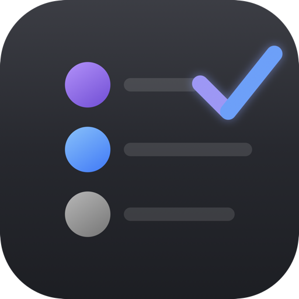

<p align="center">
  
</p>

# Daily Todo

A tiny macOS menu bar app that nags you (nicely) about your daily tasks. It lives in
your menu bar, asks what you're working on each morning, checks in on you throughout
the day, and follows up on anything still pending before you'd otherwise forget about
it.

No dock icon, no window you have to manage — just a checklist icon in the menu bar.

## Features

- **Menu bar only** — runs as an accessory app (`LSUIElement`), no Dock icon, no clutter.
- **Morning prompt** — each weekday morning, a rounded popup asks what you're working on
  today, pre-filled with your recurring default tasks and anything already pending.
- **Recurring default tasks** — tasks you mark as defaults (e.g. "Fill timesheet")
  reappear automatically every weekday morning, even if you completed or dismissed
  yesterday's instance.
- **Today's Tasks checklist** — a real checklist with checkboxes: tick a task to mark it
  complete (with a Teams/Loop-style strikethrough), or mark it not needed. Available any
  time from the menu, and pops up automatically once an hour while tasks are pending.
- **Evening review** — once tasks are still open past your configured evening time, a
  single panel lists everything outstanding with per-task actions: complete, push to
  tomorrow, or mark not needed. Snooze the whole thing for 5, 10, or 20 minutes, or let
  it default to 30.
- **Quick add** — add one or several tasks in one sitting via a small rounded popup, no
  need to reopen it per item.
- **Alert sound** — a short chime plays whenever a reminder pops up on its own, so it's
  noticeable even if the app isn't in focus. Toggle it off from Preferences.
- **Preferences window** — set your own morning/evening times, snooze durations, and
  hourly check-in interval from the menu. No rebuilding or environment variables needed.
- **Notification banners (optional)** — swap the blocking pop-up windows for regular
  macOS notification banners that summarize what's pending; click one to open the full
  panel. Off by default, toggle it on from Preferences.
- **Pending count badge** — the menu bar icon shows how many tasks are still open today,
  at a glance.
- **Launch at login** — optional, toggled from the menu.

## Requirements

- macOS 13 (Ventura) or later
- Xcode command line tools / Swift 5.9+ toolchain (`swift --version` to check)

## Building & running

```bash
git clone <this-repo-url>
cd daily-todo-app
./build.sh
open DailyTodo.app
```

`build.sh` builds a release binary with Swift Package Manager, bundles it into
`DailyTodo.app` with its icon and `Info.plist`, and ad-hoc signs it. There's no
Xcode project — it's a plain SwiftPM executable target.

For local development, `swift build` / `swift run` work as usual against the debug
build.

To have it launch automatically at login, enable **Launch at Login** from the menu bar
icon's dropdown after your first launch.

## Sharing it with others

To hand colleagues something they can just drag into Applications instead of building
from source, package a `.dmg`:

```bash
./create_dmg.sh
```

This builds the app (if it isn't already) and produces `DailyTodo.dmg` — a disk image
with `DailyTodo.app` and an `Applications` shortcut, ready to share.

Since the app is only ad-hoc signed (not notarized by Apple), first launch on another
Mac will trigger a Gatekeeper warning. Recipients should right-click the app and choose
**Open**, or allow it via System Settings → Privacy & Security → **Open Anyway**.

## Usage

Click the checklist icon in the menu bar for:

- **Today's Tasks** — view/complete/dismiss today's list any time.
- **Add Task…** — quickly add one or more tasks for today.
- **Edit Default Tasks…** — manage the tasks that recur every weekday morning.
- **Preferences…** — schedule times, snooze durations, sound, and notification-banner mode.
- **Launch at Login** — toggle.

Everything else (morning prompt, hourly check-ins, evening review) happens
automatically on the schedule described above, Monday–Friday only.

## Configuration

Open **Preferences…** from the menu to set morning/evening times, snooze durations, the
hourly check-in interval, sound, and notification-banner mode. Every control saves
immediately — no restart needed, and no rebuilding required for colleagues who just
want to tweak their own schedule.

For local development, the same settings can still be seeded via environment variables
— handy for testing without waiting for the real time of day to roll around. These only
take effect the *first* time the app runs (before `preferences.json` exists); after
that, whatever's in Preferences wins:

| Variable | Meaning | Default |
|---|---|---|
| `DAILYTODO_MORNING_MINUTES` | Minutes after midnight the morning prompt becomes eligible | `600` (10:00am) |
| `DAILYTODO_EVENING_MINUTES` | Minutes after midnight the evening review becomes eligible | `990` (4:30pm) |
| `DAILYTODO_SNOOZE_SECONDS` | Re-show interval for a snoozed morning prompt | `900` (15 min) |
| `DAILYTODO_EVENING_SNOOZE_SECONDS` | Default evening review snooze if none is picked | `1800` (30 min) |
| `DAILYTODO_HOURLY_SECONDS` | Interval between automatic checklist pop-ups | `3600` (1 hour) |
| `DAILYTODO_POLL_SECONDS` | How often the scheduler checks the clock (dev-only, not in Preferences) | `30` |

Example:

```bash
DAILYTODO_MORNING_MINUTES=0 DAILYTODO_POLL_SECONDS=1 swift run
```

To re-seed from environment variables again, quit the app and delete
`~/Library/Application Support/DailyTodo/preferences.json`.

## Data storage

All tasks and preferences are stored locally in:

```
~/Library/Application Support/DailyTodo/
├── tasks.json         # tasks per day
├── defaults.json      # recurring default tasks
├── state.json         # scheduling bookkeeping (last shown times, etc.)
└── preferences.json   # schedule/sound/notification settings
```

Nothing leaves your machine — there's no network access or telemetry. Notification
banners (if enabled) are posted locally through macOS's own notification center, same
as any other app.

## Project structure

```
Sources/DailyTodo/
├── main.swift                        # app entry point
├── AppDelegate.swift                 # menu bar item + menu + pending-count badge
├── Scheduler.swift                   # polls the clock, decides when to show what
├── TaskStore.swift                   # persistence for tasks/state/defaults
├── PreferencesStore.swift            # persisted schedule/sound/notification settings
├── PreferencesPanelController.swift  # Preferences window
├── NotificationManager.swift         # UNUserNotificationCenter wrapper for banner mode
├── Prompts.swift                     # thin dispatch layer to the panel controllers
├── FancyPanel.swift                  # shared rounded-card window + button styles
├── MorningPanelController.swift      # morning "what are you working on" prompt
├── ChecklistPanelController.swift    # "Today's Tasks" checklist
├── ChecklistUI.swift                 # checkbox + task row views
├── EveningReviewPanelController.swift# evening pending-task review
├── ListEditorPanelController.swift   # shared "add/edit list of items" panel
├── ReminderSound.swift               # alert sound for automatic pop-ups
└── LaunchAtLogin.swift               # SMAppService wrapper
```

## Contributing

Issues and PRs welcome. It's a small, dependency-free SwiftPM project on purpose —
keep it that way if you can.

## License

No license has been added yet, so default copyright applies (all rights reserved) even
though the source is public. If you want to use, modify, or redistribute this, reach
out first, or ask for a license to be added.
